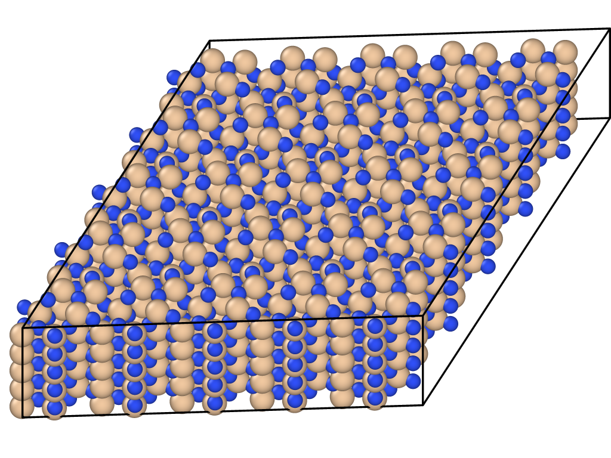
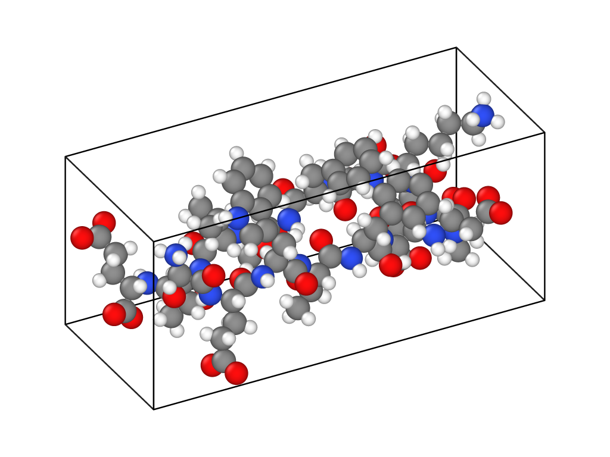

# lmp_str.jl
***molecule builder for LAMMPS in Julia***

| **Documentation** |
|:-------------------:|
|[](https://lmp-strjl.readthedocs.io/en/latest/?badge=latest)|
## Requirements
The current version of `lmp_str.jl` requires **Julia 1.0** or higher.

## Quick start
### (a) Install with Julia Pkg
The package can be installed with the Julia package manager. From the Julia REPL, type ] to enter the Pkg REPL mode and run:
```julia-repl
julia> ]
(@v1.x) pkg> add https://github.com/zhenyuwei99/lmp_str.jl.git
```
This method is convenient, while the path of `lmp_str` may take some time to found. Usually it will be `$HOME/.julia/packages/lmp_str/{version code}`. Meanwhile, files in this path are read-only.

More about Pkg: [Julia Pkg Manual](https://docs.julialang.org/en/v1/stdlib/Pkg/), [中文文档](https://cn.julialang.org/JuliaZH.jl/latest/stdlib/Pkg/#%E6%B7%BB%E5%8A%A0%E6%9C%AC%E5%9C%B0%E5%8C%85)

### (b) Install from source code
- Download the source code with git clone, not Zips!
  ```
  cd {target_path}
  git clone https://github.com/zhenyuwei99/lmp_str.git lmp_str
  ```
- Add package in julia

  ```julia-repl
  julia> ]
  (@v1.x) pkg> add "{target_path}/lmp_str"
  ```
This method require one more steps but more flexible.

## Basic Description:
`lmp_str` is a Julia module used to generate the `.data` file for LAMMPS (MD simulation package). You can construct models with build-in functions and convert models created by other software, e.g. VMD, into a `.data` file. The workflow is shown in the flowchart below:


<center>


</center>

## Examples
All codes and required files can be found in `{dir of lmp_str modeule}/examples` folder. The result gallery is created by OVITO.

### generator
This example shows the basic pipline used in generator part of `lmp_str` to create lattice.
```julia-repl
file_out = "test.data"

data_cell = genr_cell([5, 5, 5])
str = structure_si3n4()
data = genr(data_cell, str)
write_data(data, file_out)
```
Or try run `str.jl` file in examples/generator folder. Results is shown below:


### converter
This example shows the simple conversion from `.pdb` and `.psf` file created by VMD into `.data` file, which can be used in LAMMPS. The parameters for pair potential, bond, angle, dihedral, improper are all generated automatically. 
```julia-repl
file_pdb = "test.pdb"
file_psf = "test.psf"
file_out = "test.data"

data = converter_vmd(file_pdb, file_psf, potential_charmm36)
write_data(data, file_out)
```
Result is shown below:

