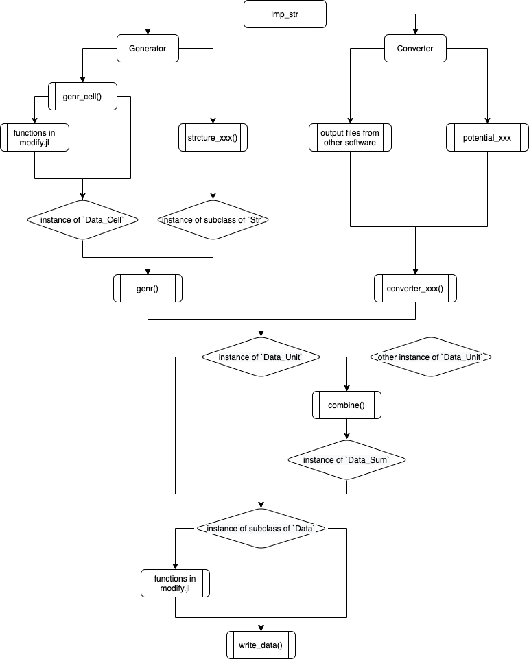

# Installation

## Install with Julia Pkg
```julia-repl
julia> ]
(@v1.x) pkg> add https://github.com/zhenyuwei99/lmp_str.git
```
This method is convenient while the path of "lmp_str" may take some time to found. Usually it will be "$HOME/.julia/packages/lmp_str/\<version code\>". Meanwhile, files in this path is readonly.

More about Pkg: [Julia Pkg Manual](https://docs.julialang.org/en/v1/stdlib/Pkg/), [中文文档](https://cn.julialang.org/JuliaZH.jl/latest/stdlib/Pkg/)

## Install from source code
- Download the source code with git clone in path `path_lmp_str`, not Zips!
  ```
  git clone https://github.com/zhenyuwei99/lmp_str.git
  ```
- Add package in julia

  ```julia-repl
  julia> ]
  (@v1.x) pkg> add path_lmp_str
  ```
This method require one more steps but more flexible.

# Basic Description:
"lmp_str" is a Julia module that is used to generate the ".data" file for LAMMPS (MD simulation package). You can construct models with build-in functions and convert models created by other software, ¯e.g. VMD, into a ".data" file. Work flow shown in flowchart below:


<center>



</center>

# Two simple examples
Both examples can be tested in "\<dir of lmp_str modeule\>/examples" folder.
## generator
```julia-repl
file_out = "test.data"

data_cell = genr_cell([5, 5, 5])
str = structure_si3n4()
data = genr(data_cell, str)
write_data(data, file_out)
```
## converter
```julia-repl
file_pdb = "test.pdb"
file_psf = "test.psf"
file_out = "test.data"

data = converter_vmd(file_pdb, file_psf, potential_charmm36)
write_data(data, file_out)
```


